<div align="center">

# ⚡ NEURAL LINK ESTABLISHED ⚡

```
██╗  ██╗ █████╗  ██████╗██╗  ██╗███████╗██████╗     ████████╗███████╗██████╗ ███╗   ███╗██╗███╗   ██╗ █████╗ ██╗     
██║  ██║██╔══██╗██╔════╝██║ ██╔╝██╔════╝██╔══██╗    ╚══██╔══╝██╔════╝██╔══██╗████╗ ████║██║████╗  ██║██╔══██╗██║     
███████║███████║██║     █████╔╝ █████╗  ██████╔╝       ██║   █████╗  ██████╔╝██╔████╔██║██║██╔██╗ ██║███████║██║     
██╔══██║██╔══██║██║     ██╔═██╗ ██╔══╝  ██╔══██╗       ██║   ██╔══╝  ██╔══██╗██║╚██╔╝██║██║██║╚██╗██║██╔══██║██║     
██║  ██║██║  ██║╚██████╗██║  ██╗███████╗██║  ██║       ██║   ███████╗██║  ██║██║ ╚═╝ ██║██║██║ ╚████║██║  ██║███████╗
╚═╝  ╚═╝╚═╝  ╚═╝ ╚═════╝╚═╝  ╚═╝╚══════╝╚═╝  ╚═╝       ╚═╝   ╚══════╝╚═╝  ╚═╝╚═╝     ╚═╝╚═╝╚═╝  ╚═══╝╚═╝  ╚═╝╚══════╝
```


```
🔥 SYSTEM BREACH DETECTED 🔥
⚡ ACCESSING MAINFRAME... ████████████ 100%
💾 LOADING HACKER PROFILE...
🌐 CONNECTION: SECURE
```

---

</div>

## 🖥️ TERMINAL SESSION - USER: Pietro Bonaldo 🖥️

<div align="center">

<table>
<tr>
<td width="50%">

```bash
┌─[root@PiBOH]─[~]
└──╼ $ whoami
[Your alias]

┌─[root@PiBOH]─[~]  
└──╼ $ cat /etc/location
Italy

┌─[root@PiBOH]─[~]
└──╼ $ systemctl status
Hig Scholl student
```

</td>
<td width="50%">

```bash
┌─[root@PiBOH]─[~]
└──╼ $ cat ~/.profile
HACKER_LEVEL=ELITE
FIREWALL_STATUS=BYPASSED
NEURAL_LINK=ACTIVE

┌─[root@PiBOH]─[~]
└──╼ $ echo $MISSION
[Your bio]
```

</td>
</tr>
</table>

```
═══════════════════════════════════════════════════════════════════════════════
⚡ NEURAL INTERFACE SYNCHRONIZED ⚡ ACCESSING DIGITAL UNDERGROUND ⚡
═══════════════════════════════════════════════════════════════════════════════
```

</div>

---

<div align="center">

## 🔥 CYBER ARSENAL - WEAPONS CACHE 🔥

*Loading digital warfare toolkit...*


</div>

<table align="center">
<tr>
<td align="center" width="25%">

### 💻 **CORE SYSTEMS**
<div style="background: linear-gradient(135deg, #0d1117 0%, #1a0033 50%, #330066 100%); padding: 20px; border: 2px solid #ff0080; border-radius: 15px;">

](https://skillicons.dev)&theme=dark)

```
STATUS: LOADED
THREAT: MAXIMUM
```

</div>

</td>
<td align="center" width="25%">

### 🛡️ **FRAMEWORKS**
<div style="background: linear-gradient(135deg, #0d1117 0%, #001a33 50%, #003366 100%); padding: 20px; border: 2px solid #00ffff; border-radius: 15px;">


```
STATUS: ACTIVE
DEFENSE: ONLINE
```

</div>

</td>
<td align="center" width="25%">

### ⚡ **EXPLOITS**
<div style="background: linear-gradient(135deg, #0d1117 0%, #1a3300 50%, #336600 100%); padding: 20px; border: 2px solid #00ff00; border-radius: 15px;">


```
STATUS: LEARNING
PROGRESS: 67%
```

</div>

</td>
<td align="center" width="25%">

### 🔐 **ENCRYPTION**
<div style="background: linear-gradient(135deg, #0d1117 0%, #330011 50%, #660022 100%); padding: 20px; border: 2px solid #ff4444; border-radius: 15px;">


```
STATUS: ENCRYPTED
LEVEL: QUANTUM
```

</div>

</td>
</tr>
</table>

---

<div align="center">

## 💾 ACTIVE OPERATIONS - CLASSIFIED FILES 💾

```
🔓 DECRYPTING PROJECT DATABASE...
⚡ ACCESSING SECURE REPOSITORIES...
🌐 LOADING OPERATION DETAILS...
```


</div>

<table align="center">
<tr>
<td width="50%" align="center">

### 🔥 **OPERATION PHOENIX**
#### 💻 Flowonline2 💻

<div align="center">

</div>

```bash
┌─[CLASSIFIED]─[OPERATION_PHOENIX]
└──╼ $ cat mission_brief.txt
THREAT LEVEL: ████████████ HIGH
ENCRYPTION: AES-256
STATUS: INFILTRATING TARGET
```

*a cross-platform, multilingual web engine that breaks OS barriers to deliver frictionless coding education directly in your browser.*

[](https://piboh.github.io/flowonline2)

</td>
<td width="50%" align="center">

### ⚡ **OPERATION NEON**
#### 💻 [Your project2Name] 💻

<div align="center">

</div>

```bash
┌─[CLASSIFIED]─[OPERATION_NEON]
└──╼ $ cat mission_brief.txt
THREAT LEVEL: ████████████ CRITICAL
ENCRYPTION: QUANTUM
STATUS: BREACHING FIREWALL
```

*[Your project2Description]*

[]([Your project2Link])

</td>
</tr>
<tr>
<td colspan="2" align="center">

### 🌐 **OPERATION MATRIX**
#### 💻 [Your project3Name] 💻

<div align="center">

</div>

```bash
┌─[TOP_SECRET]─[OPERATION_MATRIX]
└──╼ $ cat mission_brief.txt
THREAT LEVEL: ████████████ MAXIMUM
ENCRYPTION: NEURAL_LINK
STATUS: ACCESSING THE MATRIX
CLEARANCE: EYES ONLY
```

*[Your project3Description]*

[]([Your project3Link])

</td>
</tr>
</table>

---

<div align="center">

## 📊 SYSTEM DIAGNOSTICS - NEURAL ANALYTICS 📊

```
🔥 RUNNING DEEP SYSTEM SCAN...
⚡ ANALYZING NEURAL PATTERNS...
💾 GENERATING HACKER METRICS...
```


<table>
<tr>
<td align="center">


</td>
<td align="center">


</td>
</tr>
</table>

### 🔥 **NEURAL NETWORK STATUS** 🔥

<div align="center">

```
┌─────────────────────────────────────────────────────────────┐
│  🖥️  TERMINAL METRICS                                       │
├─────────────────────────────────────────────────────────────┤
│  ⚡ ACTIVE CONNECTIONS: [VISITOR_COUNT]                     │
│  💾 REPOSITORIES HACKED: [REPO_COUNT]                      │
│  🔥 COMMITS PUSHED: [COMMIT_COUNT]                         │
│  🌐 NEURAL UPTIME: [STREAK_DAYS] DAYS                      │
│  🛡️ SECURITY BREACHES: 0 (UNHACKABLE)                     │
└─────────────────────────────────────────────────────────────┘
```


</div>

</div>

---

<div align="center">


## 🌐 ESTABLISH SECURE CONNECTION 🌐

*Choose your preferred communication protocol:*

<table align="center">
<tr>
<td align="center">

[]([Your linkedin])

</td>
<td align="center">

[]([Your twitter])

</td>
<td align="center">

[](https://piboh.github.io/)

</td>
</tr>
</table>

---

### 💾 **CONNECTION LOG** 💾

<p align="center">
  
</p>

```
┌─────────────────────────────────────────────────────────────────────────────────┐
│                                                                                 │
│  ⚡ "Welcome to the underground, fellow hacker.                                 │
│     You've just connected to a secure terminal.                                │
│     All communications are encrypted and untraceable.                          │
│     Remember: Information wants to be free.                                    │
│     Stay anonymous. Stay vigilant. Hack the planet." ⚡                        │
│                                                                                 │
│  💾 System Administrator: Pietro Bonaldo                                             │
│  🔥 Terminal ID: PiBOH                                                  │
│  🌐 Last Login: [TIMESTAMP_NOW]                                               │
│                                                                                 │
└─────────────────────────────────────────────────────────────────────────────────┘
```

<sub>*🔐 This terminal session is secured with quantum encryption. All data transmissions are protected by advanced cybersecurity protocols. 🔐*</sub>


</div>
<!-- <picture>
  <source media="(prefers-color-scheme: dark)" srcset="./assets/dark.svg">
  <source media="(prefers-color-scheme: light)" srcset="./assets/light.svg">
  
</picture>

<p align="center">
  <a href="https://github.com/PiBOH">GitHub</a> ·
  <a href="https://piboh.github.io/">Portfolio</a> ·
  <a href="mailto:piboh.github@gmail.com">Email</a> ·
  <a href="https://www.barsantigalilei.edu.it/index.php/struttura/istituto-di-istruzione-superiore-barsanti-galilei/scuola/)">IIS Barsanti-Galilei</a> ·
  <a href="https://www.instagram.com/piboh.github.io?igsh=MXdtcDI2dXZqbzd2Mw==">Instagram</a>
</p>

<!-- 
---

### 📱 Le mie Applicazioni & Web App

* **[CodeLearn1](https://github.com/PiBOH/CodeLearn1)** 💻 – Una piattaforma interattiva per imparare **10 linguaggi diversi** (Python, JS, Java, Kotlin, Swift, C#, C++, C, PHP, HTML) divertendosi.
  * 🌐 *Demo Live:* [code-learn1.vercel.app](https://code-learn1.vercel.app/) (progressi salvati su supabase).
  * *💡 Tip:* Usa `-LOCAL` alla fine del nome per salvare i dati sul browser, o `-GUEST` per testarlo senza salvare nulla.
  * *Su android 11 e precedenti consiglio di utilizzare [CodeLearn1-WEB](https://github.com/PiBOH/CodeLearn1-WEB/releases/latest) (fa la stessa cosa ma va meglio).*
* **[Design-Arena-AI_APK-android](https://github.com/PiBOH/Design-Arena-AI_APK-android)** 🎨 – Il sito ufficiale di Design Arena convertito in una comoda app per dispositivi Android.
* **[Arena-AI-APK-android](https://github.com/PiBOH/Arena-AI_APK-android)** – Il sito ufficiale di Arena AI convertito in una comoda app per dispositivi Android.
* **[MCServerManagement](https://github.com/PiBOH/MCServerManagement)** 🎮 – Gestisci i tuoi server Minecraft tramite API senza pubblicità. *(Consigliato l'uso da PC).*

---

### 🛠️ Utility & Strumenti

* **[Flowonline2](https://github.com/PiBOH/flowonline2)** 🧠 – Una versione in-browser di *Flowgorithm*. L'interfaccia è fedele all'originale ed è quasi completa.
* **[pdfgen-unlocked](https://github.com/PiBOH/pdfgen-unlocked)** 📄 – Genera file PDF estraendo contenuti anche dai siti web in cui la stampa è normalmente bloccata.
* **[DeployStatusBadgeGenerator-ghpages](https://github.com/PiBOH/DeployStatusBadgeGenerator-ghpages)** 🏷️ – Genera automaticamente badge di deployment pronti per i file README dei tuoi progetti.
* **[Background remover](https://github.com/PiBOH/background-remover)** - Un tool per rimuovere lo sfondo dalle immagini (nessuna immagine viene conservata online). (fork del [progetto originario](https://github.com/balewgize/background-remover) di [balewgize](https://github.com/balewgize/))
* **[multimdreader](https://github.com/PiBOH/multimdreader)** - Un tool multilingua portable per visualizzare i file markdown. il repository è dotato di [workflow automatici](https://github.com/PiBOH/multimdreader/tree/main/.github/workflows) che buildano le varie [release per Windows, MacOS e Linux](https://github.com/PiBOH/multimdreader/releases/latest). è anche dotato di un [workflow](https://github.com/PiBOH/multimdreader/tree/main/.github/workflows) che fa sia il delpoy della landing page del repo, sia il delpoy della demo, il tutto su [github pages](https://piboh.github.io/multimdreader/).

### 🎮 Giochetti vari.

* **[2048-game](https://github.com/PiBOH/2048-game)** 🕹️ – Il classico gioco rompicapo numerico, perfetto per quando ci si annoia.
* **[wbwwb2-game](https://github.com/PiBOH/wbwwb2-game)** - Una rielaborazione del gioco di [Nicky Case](https://ncase.itch.io/) ottimizzata e tradotta in italiano per [GitHub pages](https://piboh.github.io/wbwwb2-game/).
* **[FreeGDL](https://github.com/PiBOH/FreeGDL)** - Una versione gratutia, senza pubblicità, e ottimizzata per [GitHub pages](https://piboh.github.io/FreeGDL) del famoso gioco Geometry Dash. (la versione del gioco è un po' vecchiotta).
* **[XTetris](https://github.com/PiBOH/XTetris)** - una versione cli del famoso gioco tetris. (forkato dal [repo](https://github.com/AlexGiulioBerton/XTetris) di AlexGiulioBerton.

---

### 📊 Statistiche

<p align="left">
  
  
</p>

---

### 📫 Contatti & Collegamenti

* 🌐 **Sito Web:** Scopri tutti i miei lavori su [piboh.github.io](https://piboh.github.io/)
* 📧 **E-mail:** Se hai domande o hai bisogno di supporto, scrivimi a [piboh.github@gmail.com](mailto:piboh.github@gmail.com) *(di solito rispondo entro 2 settimane)*.

Buon divertimento!

*Firmato,* **PiBOH** 

***
***
Ho ricreato tutto il profilo da zeero perché ho creato una [mail](mailto:piboh.github@gmail.com) apposta per le cose di github e mi sono quindi ri-registrato e ho dovuto quindi eliminare e repository e ripubblicarli su [questo profilo](https://github.com/PiBOH) (così facendo alcuni collegamenti non vanno, non appena ne trovi uno buggato segnalalo [qui](mailto:piboh.github@gmail.com). Per vedere il vecchio profilo clicca [qui](https://github.com/PiBOH98a/).

Grazie a tutti per il supporto.
<!--- *(PietroBonaldo)* --->
<!-- # Ciao, sono PiBOH (Pietro Bonaldo) 👋

Benvenuto nel mio profilo GitHub! Sono uno studente di informatica presso l'**[IIS Barsanti-Galilei](https://www.barsantigalilei.edu.it/) ([Plesso ITIS](https://www.barsantigalilei.edu.it/index.php/struttura/istituto-di-istruzione-superiore-barsanti-galilei/scuola/))** e uno sviluppatore indipendente appassionato di Web App, Utility Tools e applicazioni per dispositivi Android.

---

### 🌐 Connettivi con me

[](https://piboh.github.io)
[](mailto:piboh.github@gmail.com)

---

### 🏛 Organizzazioni

Sviluppo attivamente all'interno di queste organizzazioni:
* 🎮 **[@PiBOH-MC](https://github.com/PiBOH-MC)** — Progetti e tool dedicati al mondo di Minecraft.
* 📚 **[@PiBOH-EDU](https://github.com/PiBOH-EDU/)** — Repository, note e risorse per l'ambito scolastico ed educativo.

---

### 🛠 Il mio Tech Stack

* **Linguaggi:** TypeScript, JavaScript, Kotlin
* **Backend & Database:** Supabase
* **Strumenti & Automazione:** Git, GitHub Actions

---

### 📁 I miei Progetti Principali

#### 📱 Applicazioni & Web App
* **[CodeLearn1](https://github.com/PiBOH/CodeLearn1#js-repo-pjax-container)** — Piattaforma interattiva per imparare 10 linguaggi divertendosi. Salva i progressi sul cloud con Supabase. (Demo: [code-learn1.vercel.app](https://code-learn1.vercel.app)).
* **[Design-Arena-AI](https://github.com/PiBOH/Design-Arena-AI_APK-android) & [Arena-AI](https://github.com/PiBOH/Arena-AI_APK-android)** — Applicazioni Android (.APK) ufficiali ottimizzate partendo dai rispettivi siti web.
* **[MCServerManagement](https://github.com/PiBOH/MCServerManagement#js-repo-pjax-container)** — Gestione centralizzata di server Minecraft tramite chiamate API, senza pubblicità.

#### 🛠 Utility & Strumenti
* **[multimdreader](https://github.com/PiBOH/multimdreader#js-repo-pjax-container)** — Reader/editor Markdown multipiattaforma portable. Ha workflow CI/CD automatici per le build stabili e il deploy immediato della demo su GitHub Pages.
* **[flowonline2](https://github.com/PiBOH/flowonline2#js-repo-pjax-container)** — Clone web multilingua e fedele del software di diagrammi di flusso Flowgorithm.
* **[pdfgen-unlocked](https://github.com/PiBOH/pdfgen-unlocked)** — Estrattore e generatore PDF per salvare contenuti dai siti che bloccano la stampa.
* **[Background remover](https://github.com/PiBOH/background-remover#js-repo-pjax-container)** — Tool locale per rimuovere lo sfondo dalle immagini salvaguardando la privacy (nessun dato online).
* **[DeployStatusBadgeGenerator-ghpages](https://github.com/PiBOH/DeployStatusBadgeGenerator-ghubpages)** — Generatore di badge di stato per i file README dei repository.

#### 🎮 Giochi & Esperimenti
* **[2048-game](https://github.com/PiBOH/2048-game)** — Il celebre rompicapo numerico ottimizzato per browser.
* **[wbwwb2-game](https://github.com/PiBOH/wbwwb2-game#js-repo-pjax-container)** — Rielaborazione ottimizzata e interamente tradotta in italiano del gioco interattivo di Nicky Case.
* **[FreeGDL](https://github.com/PiBOH/FreeGDL#js-repo-pjax-container)** — Versione gratuita, leggera e senza pubblicità di Geometry Dash per GitHub Pages.
* **[XTetris](https://github.com/PiBOH/XTetris#js-repo-pjax-container)** — Il classico gioco del Tetris giocabile direttamente da riga di comando (CLI).

---

### 📊 Le mie Statistiche su GitHub

<p align="center">
  
  
</p>

---

<p align="center"><em>Firmato, PiBOH 💻</em></p>

## Star History

[](https://www.star-history.com/?repos=PiBOH-EDU%2Ftcr-notes%2CPiBOH%2FFreeGDL%2CPiBOH%2FCodeLearn1%2CPiBOH%2FXTetris%2CPiBOH%2Fpiboh.github.io%2CPiBOH%2FPiBOH%2CPiBOH%2Fflowonline2%2CPiBOH%2FCodeLearn1-WEB%2CPiBOH%2FArena-AI_APK-android%2CPiBOH%2Fmultimdreader%2CPiBOH%2FMCServerManagement&type=date&legend=bottom-right) -->

<!--- ## Hi there 👋 --->

<!--
**PiBOH/PiBOH** is a ✨ _special_ ✨ repository because its `README.md` (this file) appears on your GitHub profile.

Here are some ideas to get you started:

- 🔭 I’m currently working on ...
- 🌱 I’m currently learning ...
- 👯 I’m looking to collaborate on ...
- 🤔 I’m looking for help with ...
- 💬 Ask me about ...
- 📫 How to reach me: ...
- 😄 Pronouns: ...
- ⚡ Fun fact: ...
-->
<!-- Tutti i repository taggati con [questa star](https://github.com/stars/PiBOH/lists/%F0%9F%85%B0-%E2%84%B9) hanno traccia di codice AI.
